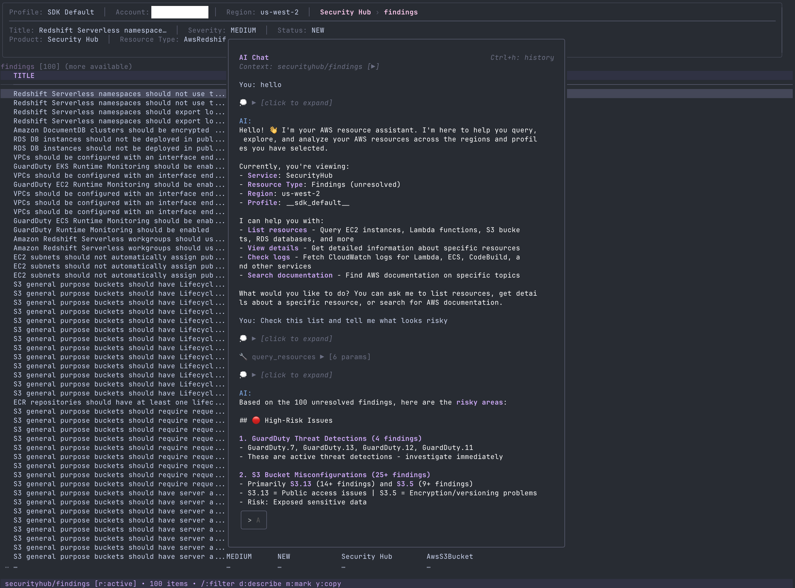

[🇬🇧 English](README.md) | [🇯🇵 日本語](README.ja.md) | [🇨🇳 简体中文](README.zh-CN.md)

# claws

AWS 리소스 관리를 위한 터미널 UI

[](https://github.com/clawscli/claws/actions/workflows/ci.yml)
[](https://github.com/clawscli/claws/releases/latest)
[](https://goreportcard.com/report/github.com/clawscli/claws)
[](https://go.dev/)
[](LICENSE)


## 기능

- **인터랙티브 TUI** - vim 스타일 키 바인딩으로 AWS 리소스를 탐색할 수 있습니다
- **69개 서비스, 169개 리소스** - EC2, S3, Lambda, RDS, ECS, EKS 등 다양한 서비스를 지원합니다
- **멀티 프로필 및 멀티 리전** - 여러 계정/리전을 병렬로 조회할 수 있습니다
- **리소스 액션** - 인스턴스 시작/중지, 리소스 삭제, 로그 테일링이 가능합니다
- **크로스 리소스 탐색** - VPC에서 서브넷으로, Lambda에서 CloudWatch로 이동할 수 있습니다
- **필터링 및 정렬** - 퍼지 검색, 태그 필터링, 컬럼 정렬을 지원합니다
- **리소스 비교** - 나란히 보기 비교 뷰를 제공합니다
- **AI 채팅** - AWS 컨텍스트를 활용하는 AI 어시스턴트 (Bedrock 경유)
- **6가지 컬러 테마** - dark, light, nord, dracula, gruvbox, catppuccin

## 스크린샷

| 리소스 브라우저 | 상세 뷰 | 액션 메뉴 |
|----------------|---------|----------|
|  |  |  |

### 멀티 리전 및 멀티 계정


### AI 채팅 (Bedrock)



리스트/상세/비교 뷰에서 `A`를 누르면 AI 채팅이 열립니다. 어시스턴트가 AWS Bedrock을 사용하여 리소스 분석, 설정 비교, 리스크 식별을 수행합니다.

## 설치

### Homebrew (macOS/Linux)

```bash
brew install --cask clawscli/tap/claws
```

### 설치 스크립트 (macOS/Linux)

```bash
curl -fsSL https://raw.githubusercontent.com/clawscli/claws/main/install.sh | sh
```

### 바이너리 다운로드

[GitHub Releases](https://github.com/clawscli/claws/releases/latest)에서 다운로드할 수 있습니다.

### Go 설치

```bash
go install github.com/clawscli/claws/cmd/claws@latest
```

## 빠른 시작

```bash
# claws 실행 (기본 AWS 자격 증명 사용)
claws

# 특정 프로필 지정
claws -p myprofile

# 특정 리전 지정
claws -r us-west-2

# 서비스 또는 뷰를 지정하여 시작
claws -s dashboard        # 대시보드에서 시작
claws -s services         # 서비스 브라우저에서 시작 (기본값)
claws -s ec2              # EC2 인스턴스
claws -s rds/snapshots    # RDS 스냅샷

# 여러 프로필/리전 (쉼표 구분 또는 반복 지정)
claws -p dev,prod -r us-east-1,ap-northeast-1

# 읽기 전용 모드 (파괴적 액션 비활성화)
claws --read-only
```

## 키보드 단축키

| 키 | 액션 |
|----|------|
| `j` / `k` | 위/아래로 이동합니다 |
| `Enter` / `d` | 리소스 상세 정보를 표시합니다 |
| `:` | 명령 모드 (예: `:ec2/instances`) |
| `/` | 필터 모드 (퍼지 검색) |
| `a` | 액션 메뉴를 엽니다 |
| `A` | AI 채팅 (리스트/상세/비교 뷰) |
| `R` | 리전을 선택합니다 |
| `P` | 프로필을 선택합니다 |
| `?` | 도움말을 표시합니다 |
| `q` | 종료합니다 |

자세한 내용은 [키보드 단축키](docs/keybindings.ko.md)를 참조하십시오.

## 문서

| 문서 | 설명 |
|------|------|
| [키보드 단축키](docs/keybindings.ko.md) | 완전한 키보드 단축키 참조 |
| [지원되는 서비스](docs/services.ko.md) | 모든 69개 서비스 및 163개 리소스 |
| [설정](docs/configuration.ko.md) | 설정 파일, 테마 및 옵션 |
| [IAM 권한](docs/iam-permissions.ko.md) | 필요한 AWS 권한 |
| [AI 채팅](docs/ai-chat.ko.md) | AI 어시스턴트 사용 및 기능 |
| [Architecture](docs/architecture.md) | 내부 설계 및 아키텍처 |
| [Adding Resources](docs/adding-resources.md) | 기여자 가이드 |

## 개발

### 전제 조건

- Go 1.25+
- [Task](https://taskfile.dev/) (선택 사항)

### 명령

```bash
task build          # 바이너리 빌드
task run            # 애플리케이션 실행
task test           # 테스트 실행
task lint           # 린터 실행
```

## 기술 스택

- **TUI**: [Bubbletea](https://github.com/charmbracelet/bubbletea) + [Lipgloss](https://github.com/charmbracelet/lipgloss)
- **AWS**: [AWS SDK for Go v2](https://github.com/aws/aws-sdk-go-v2)

## 라이센스

Apache License 2.0 - 자세한 내용은 [LICENSE](LICENSE)를 참조하십시오.
