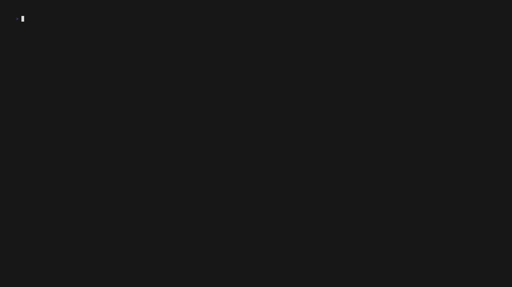
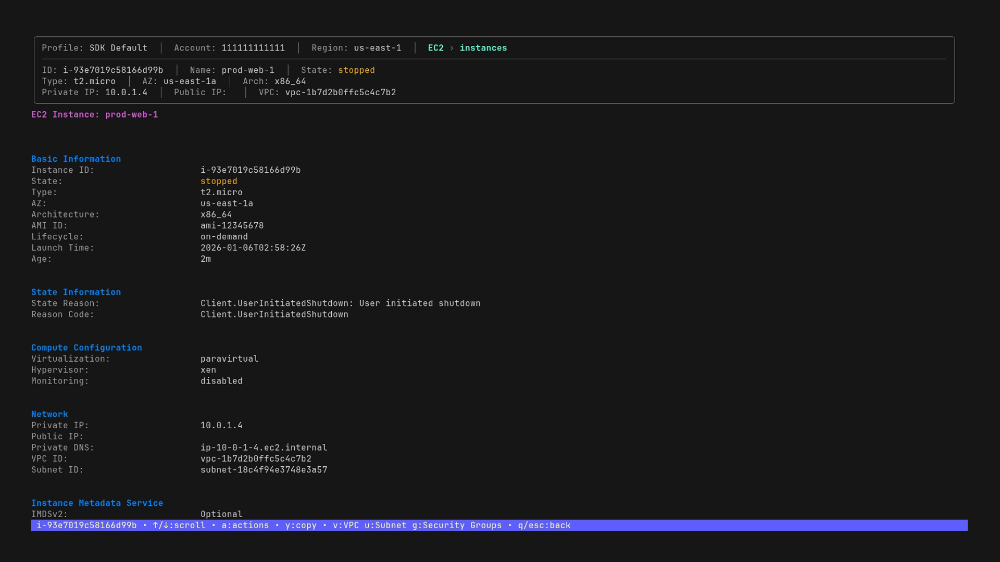
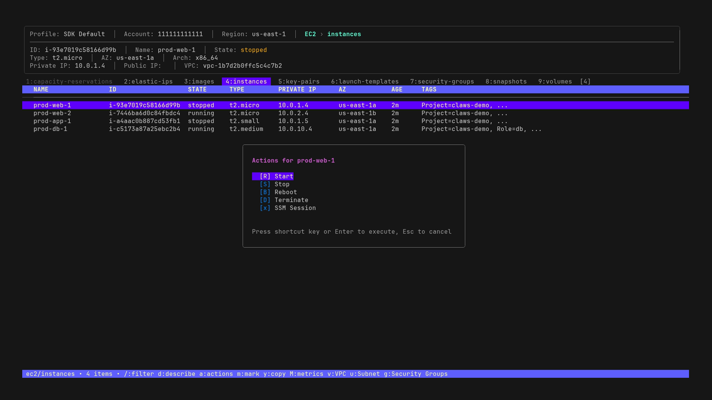
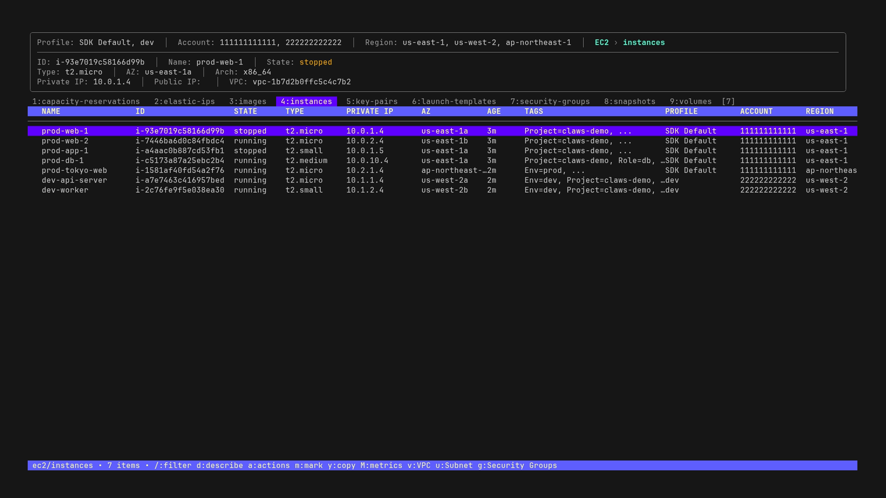

# claws

A terminal UI for AWS resource management

[](https://github.com/clawscli/claws/actions/workflows/ci.yml)
[](https://github.com/clawscli/claws/releases/latest)
[](https://goreportcard.com/report/github.com/clawscli/claws)
[](https://go.dev/)
[](LICENSE)



## Features

- **Interactive TUI** - Navigate AWS resources with vim-style keybindings
- **69 services, 163 resources** - EC2, S3, Lambda, RDS, ECS, and more
- **Multi-profile & Multi-region** - Query multiple accounts/regions in parallel
- **Resource actions** - Start/stop instances, delete resources, tail logs
- **Cross-resource navigation** - Jump from VPC to subnets, Lambda to CloudWatch
- **Filtering & sorting** - Fuzzy search, tag filtering, column sorting
- **Resource comparison** - Side-by-side diff view
- **6 color themes** - dark, light, nord, dracula, gruvbox, catppuccin

## Screenshots

| Resource Browser | Detail View | Actions Menu |
|------------------|-------------|--------------|
|  |  |  |

### Multi-Region & Multi-Account



## Installation

### Homebrew (macOS/Linux)

```bash
brew tap clawscli/tap
brew install --cask claws
```

### Install Script (macOS/Linux)

```bash
curl -fsSL https://raw.githubusercontent.com/clawscli/claws/main/install.sh | sh
```

### Download Binary

Download from [GitHub Releases](https://github.com/clawscli/claws/releases/latest).

### Go Install

```bash
go install github.com/clawscli/claws/cmd/claws@latest
```

## Quick Start

```bash
# Run claws (uses default AWS credentials)
claws

# With specific profile
claws -p myprofile

# With specific region
claws -r us-west-2

# Start directly on a service
claws -s ec2              # EC2 instances
claws -s rds/snapshots    # RDS snapshots

# Read-only mode (disables destructive actions)
claws --read-only
```

## Key Bindings

| Key | Action |
|-----|--------|
| `j` / `k` | Navigate up/down |
| `Enter` / `d` | View resource details |
| `:` | Command mode (e.g., `:ec2/instances`) |
| `/` | Filter mode (fuzzy search) |
| `a` | Open actions menu |
| `R` | Select region(s) |
| `P` | Select profile(s) |
| `?` | Show help |
| `q` | Quit |

See [docs/keybindings.md](docs/keybindings.md) for complete reference.

## Documentation

| Document | Description |
|----------|-------------|
| [Key Bindings](docs/keybindings.md) | Complete keyboard shortcuts reference |
| [Supported Services](docs/services.md) | All 69 services and 163 resources |
| [Configuration](docs/configuration.md) | Config file, themes, and options |
| [IAM Permissions](docs/iam-permissions.md) | Required AWS permissions |
| [Architecture](docs/architecture.md) | Internal design and structure |
| [Adding Resources](docs/adding-resources.md) | Guide for contributors |

## Development

### Prerequisites

- Go 1.25+
- [Task](https://taskfile.dev/) (optional)

### Commands

```bash
task build          # Build binary
task run            # Run the application
task test           # Run tests
task lint           # Run linters
```

## Tech Stack

- **TUI**: [Bubbletea](https://github.com/charmbracelet/bubbletea) + [Lipgloss](https://github.com/charmbracelet/lipgloss)
- **AWS**: [AWS SDK for Go v2](https://github.com/aws/aws-sdk-go-v2)

## License

Apache License 2.0 - see [LICENSE](LICENSE) for details.
