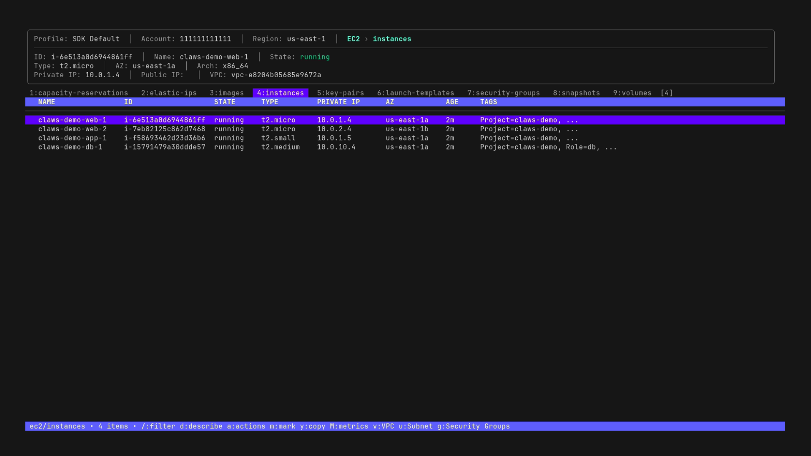
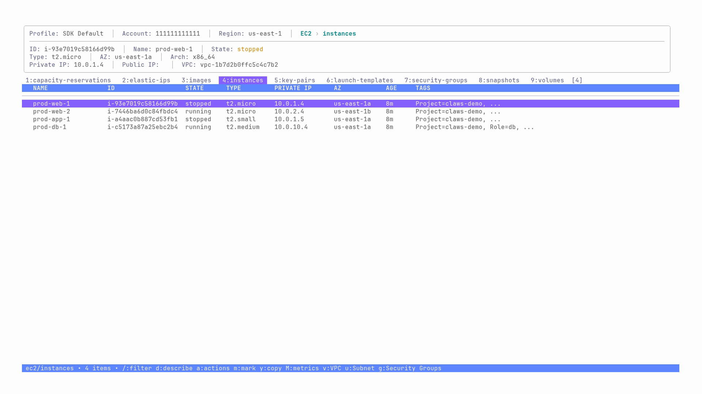
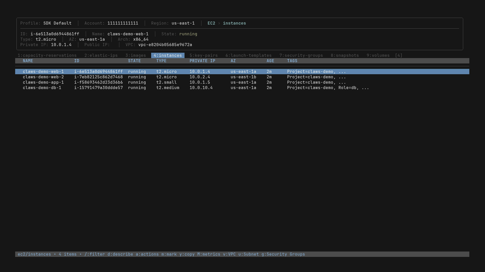
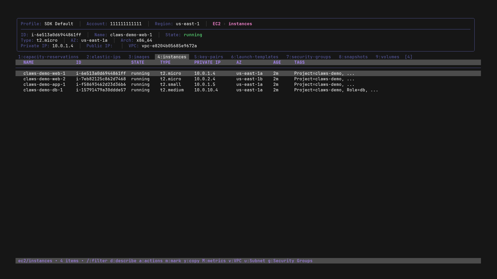
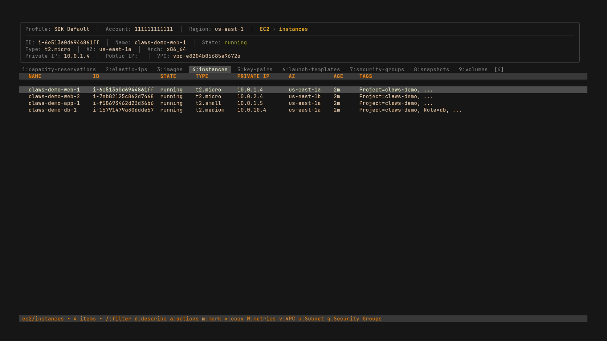
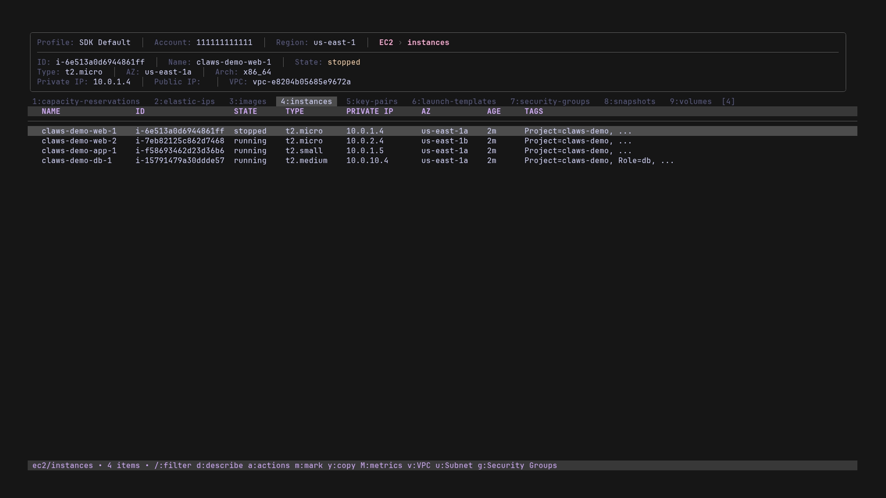

# Configuration

## AWS Credentials

claws uses your standard AWS configuration:

- `~/.aws/credentials` - AWS credentials
- `~/.aws/config` - AWS configuration (region, profile)
- Environment variables: `AWS_PROFILE`, `AWS_REGION`, `AWS_ACCESS_KEY_ID`, etc.

## Configuration File

Optional settings can be stored in `~/.config/claws/config.yaml`.

### Custom Config File Path

Use a custom config file instead of the default:

```bash
# Via CLI flag
claws -c /path/to/config.yaml
claws --config ~/work/claws-work.yaml

# Via environment variable
CLAWS_CONFIG=/path/to/config.yaml claws
```

**Precedence:** `-c` flag > `CLAWS_CONFIG` env var > default (`~/.config/claws/config.yaml`)

Use cases:
- Environment-specific configs (work/personal)
- CI/CD with project-specific settings
- Testing with different configurations

### Config File Format

```yaml
timeouts:
  aws_init: 10s           # AWS initialization timeout (default: 5s)
  multi_region_fetch: 60s # Multi-region parallel fetch timeout (default: 30s)
  tag_search: 45s         # Tag search timeout (default: 30s)
  metrics_load: 30s       # CloudWatch metrics load timeout (default: 30s)
  log_fetch: 15s          # CloudWatch Logs fetch timeout (default: 10s)

concurrency:
  max_fetches: 100        # Max concurrent API fetches (default: 50)

cloudwatch:
  window: 15m             # Metrics data window period (default: 15m)

autosave:
  enabled: true           # Save region/profile/theme/compact_header on change (default: false)

compact_header: false     # Use single-line compact header (default: false)

startup:                  # Applied on launch if present
  view: services          # Startup view: "dashboard", "services", or "service/resource" (e.g., "ec2", "rds/snapshots")
  profiles:               # Multiple profiles supported
    - production
  regions:
    - us-east-1
    - us-west-2

navigation:
  max_stack_size: 100     # Max navigation history depth (default: 100)

ai:
  profile: ""                  # AWS profile for Bedrock (empty = use current profile)
  region: ""                   # AWS region for Bedrock (empty = use current region)
  model: "global.anthropic.claude-haiku-4-5-20251001-v1:0"  # Bedrock model ID
  max_sessions: 100            # Max stored sessions (default: 100)
  max_tokens: 16000            # Max response tokens (default: 16000)
  thinking_budget: 8000        # Extended thinking token budget (default: 8000)
  max_tool_rounds: 15          # Max tool execution rounds per message (default: 15)
  max_tool_calls_per_query: 50 # Max tool calls per user query (default: 50)
  save_sessions: false         # Persist chat sessions to disk (default: false)

theme: nord               # Preset: dark, light, nord, dracula, gruvbox, catppuccin

# Or use preset with custom overrides:
# theme:
#   preset: dracula
#   primary: "#ff79c6"
#   danger: "#ff5555"
```

The config file is **not created automatically**. Create it manually if needed.

CLI flags (`-p`, `-r`, `-t`, `--compact`, `--no-compact`, `--autosave`, `--no-autosave`) override config file settings.
Multiple values supported: `-p dev,prod` or `-p dev -p prod`.

### Special Profile IDs

| ID | Description | Equivalent |
|----|-------------|------------|
| `__sdk_default__` | Use AWS SDK default credential chain | (no `-p` flag) |
| `__env_only__` | Ignore ~/.aws, use env/IMDS/ECS/Lambda creds only | `-e` flag |

```bash
# Use env-only mode via -p flag
claws -p __env_only__

# Mix named profiles with special modes (query both)
claws -p production,__env_only__
```

These IDs can also be used in `startup.profiles`:

```yaml
startup:
  profiles:
    - __sdk_default__
    - production
```


## Themes

claws includes 6 built-in color themes:

| Theme | Description |
|-------|-------------|
| `dark` | Default dark theme (pink/magenta accents) |
| `light` | For light-background terminals |
| `nord` | Nordic, calm blue palette |
| `dracula` | Popular dark theme (purple/pink) |
| `gruvbox` | Retro, warm earth tones |
| `catppuccin` | Modern pastel (Mocha variant) |

### Theme Previews

| dark | light | nord |
|------|-------|------|
|  |  |  |

| dracula | gruvbox | catppuccin |
|---------|---------|------------|
|  |  |  |

### Switching Themes

```bash
# Via command line
claws -t nord

# Via command mode (runtime)
:theme dracula
```

If autosave is enabled, theme changes are persisted to the config file.

### Custom Theme Colors

Override specific colors from a preset:

```yaml
theme:
  preset: dracula
  primary: "#ff79c6"
  danger: "#ff5555"
  success: "#50fa7b"
```

## Read-Only Mode

Disable all destructive actions:

```bash
# Via flag
claws --read-only

# Via environment variable
CLAWS_READ_ONLY=1 claws
```

## Debug Logging

Enable debug logging to a file:

```bash
claws -l debug.log
```

## IAM Permissions

For required IAM permissions, see [iam-permissions.md](iam-permissions.md).
